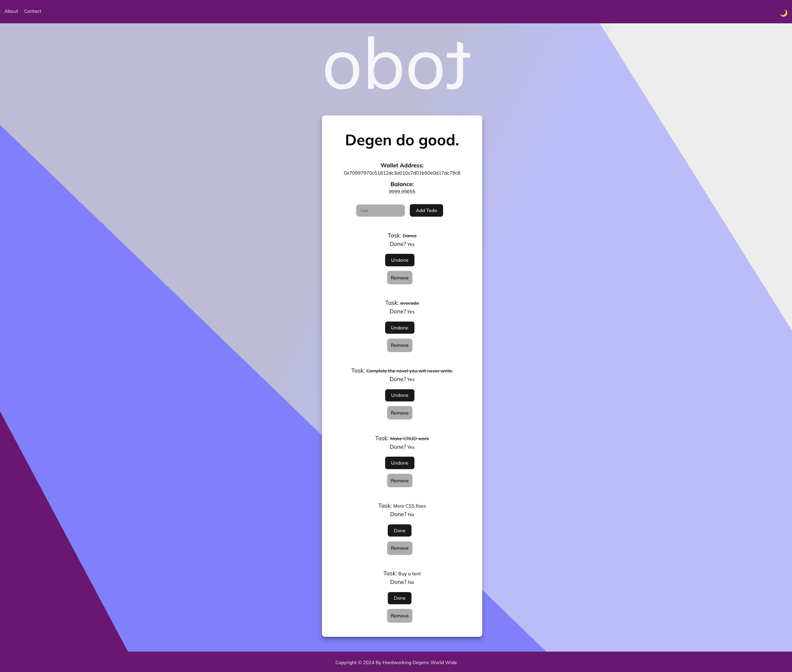
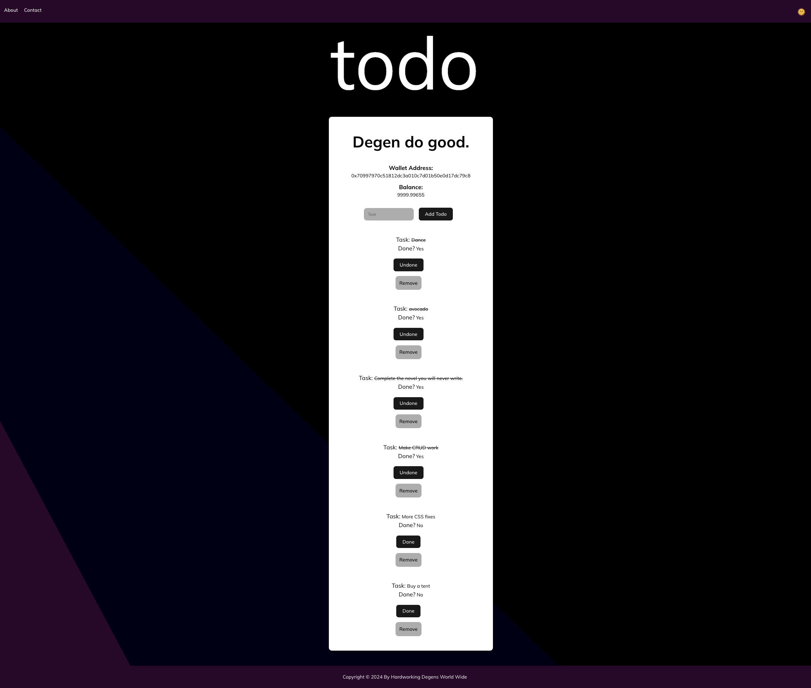

# Frontend

Detta projekt är react-applikationen som skall användas för att kommunicera med er blockchain.

## Projektet

Detta projekt använder create-react-app. Projektet har bara skapats och resten av funktionaliteten är upp till er att skapa och implementera.

## Uppgift

Skapa en ny todo-lista. Men denna gång behöver ni använda den blockchain som ligger i projektet eth-todo-list. Ni behöver fortfarande tänka react med avseende på komponenter, props och state. Det nya i denna uppgift är just Web3.

## Betyg G

- En fungerande lösning av todo-listan :white_check_mark:
- Du kan skapa todos genom ett formulär :white_check_mark:
- Du kan ta bort todos :white_check_mark:
- Du använder minst en komponent :white_check_mark:
- Du använder den blockchain som ni har fått för att spara och läsa todos :white_check_mark:
- God struktur i er kod :white_check_mark:

## Betyg VG

- Samtliga krav från betyg G :white_check_mark:
- Du kan ändra en todo till klar och tillbaka till inte klar :white_check_mark:
- Du använder minste tre komponenter :white_check_mark:
- Du använder konceptet tjänst när ni kommunicerar med er blockchain :white_check_mark:
- Du har en mycket god struktur i din kod och har försökt att refaktorera så mycket som möjligt :white_check_mark:

## Installation

1. Install Dependencies

   `npm i -y`

2. Install Hardhat

   `npm i hardhat`

3. Set Up Metamask

   - Install the Metamask extension for your browser.
   - Create an account or import an existing one.
   - Connect to the Hardhat Network by clicking on the network dropdown (usually it will say "Ethereum Mainnet").
   - Select "Custom RPC" to add the Hardhat Network details:
     - Network Name: Hardhat
     - New RPC URL: http://localhost:8545
     - Chain ID: 31337
     - Currency Symbol (optional): ETH

4. Compile your smart contracts with:

   `npx hardhat compile`

5. Hardhatnode:

   `npx hardhat node`

6. Then deploy them to the Hardhat Network with:

   `npx hardhat run --network localhost scripts/deploy.js`

   Replace scripts/deploy.js with the path to your deployment script.

7. Update the Smart Contract Address

   After deploying your smart contracts, Hardhat will output the address of the deployed contract. You need to take this address and update your application's configuration to use it.

   Open the `config.js` file (or wherever your contract address is stored), and replace the existing contract address with the new one.

8. Run the Project

   `npm run dev`

## Screenshot :camera_flash:

